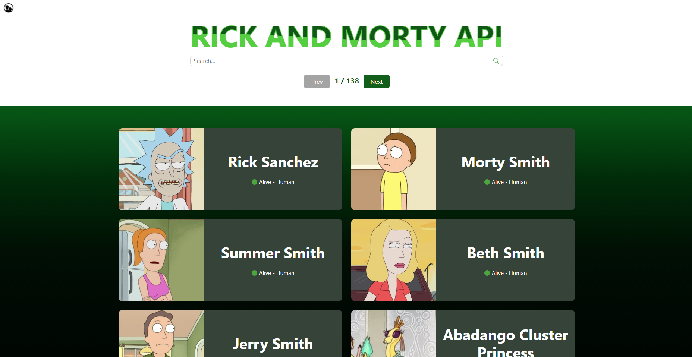

# Rick and Morty - Web Application

### Check the site here 🔍

[Rick and Morty - Web Application](https://web-application-to-consume-the-rick-and-morty-api-aexhwvhk7.vercel.app)

### What was done 🤔

An improved version of the previously developed application to list characters from the Rick and Morty series containing animations and using Bootstrap.

### Why was done 🤔

At the moment (2023) I'm studying at [Growdev](https://www.growdev.com.br/) in their fullstack web developer course and I'm currently in the Front-end III module (In this module we learn more about CSS, including flexbox, animations,
keyframes, responsiveness and Bootstrap). And, as the last challenge of this module, we were asked to create this web application to consume the [Rick and Morty API](https://rickandmortyapi.com) and list its characters.